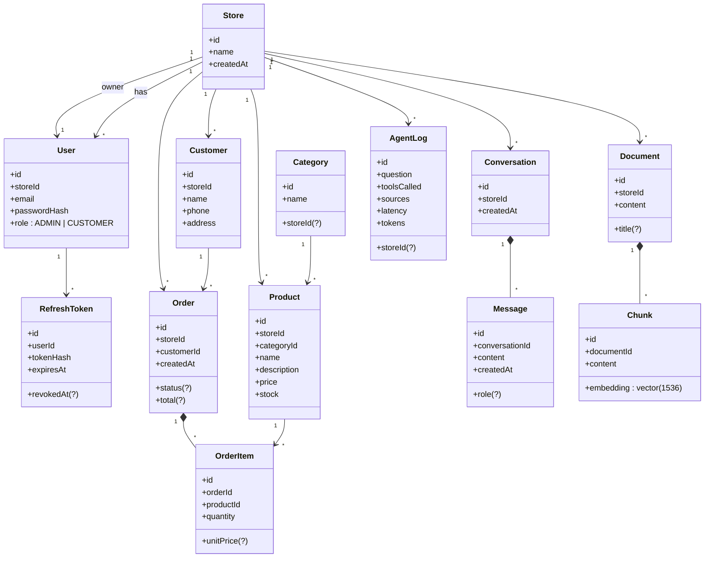
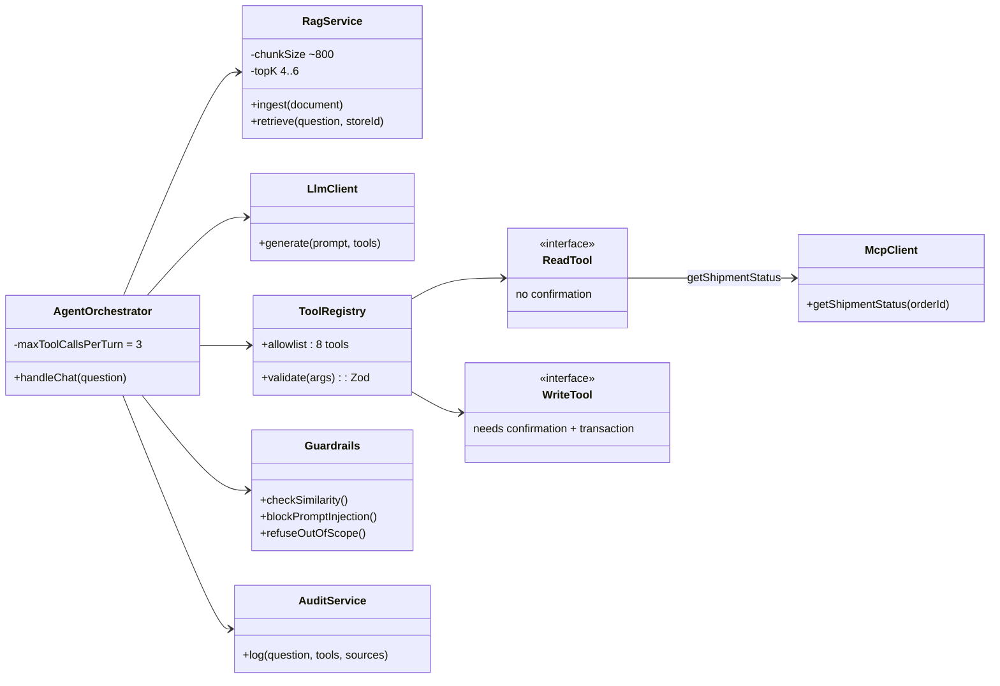

# ShopMate AI — Class Diagram

> Source: `README.md` (section "Modèle de données" + "Les outils de l'agent").
> Related Jira task: **SA-43** (UML design doc).
> ⚠️ **Draft to review.** Entity names and relations come from the README.
> Attributes marked `(?)` are **my assumptions** — Omar must check them and decide.

---

## 1. Domain classes (the database model)

### How to read it

| Symbol | Meaning |
|---|---|
| `"1" --> "*"` | One A has many B |
| `*--` (filled diamond) | B **cannot exist without** A (if the Order is deleted, its OrderItems go too) |
| `Customer ↔ Product` | **N—N**, solved by the middle class `OrderItem` |
| `storeId` | Multi-tenant key. It comes from the **JWT on the server**, never from the client. |

---

## 2. AI layer (backend classes, simplified)

### The 8 tools

| Type | Tools |
|---|---|
| **ReadTool** (no confirmation) | `searchProducts`, `getProductDetails`, `checkStock`, `getOrderStatus`, `listMyOrders`, `getShipmentStatus` (via MCP) |
| **WriteTool** (confirmation + transaction) | `createOrder`, `cancelOrder` |

---

## 3. Questions to check (Omar's homework)

1. Is `Category` linked to a `Store`? (the README ERD does **not** show it — but multi-tenant says every row should have a `storeId`)
2. Is `AgentLog` linked to `Conversation` or `User` too? (README only says it's an audit journal)
3. What are the real `Order.status` values? (for example: PENDING, CONFIRMED, DELIVERED, CANCELLED)
4. Should `Customer` be linked to `User` (customer login)? The README says roles `ADMIN` / `CUSTOMER`.
5. Which ORM: **Prisma** (README) or **Sequelize** (Jira SA-3)? The diagram is the same, but the schema file is different.
